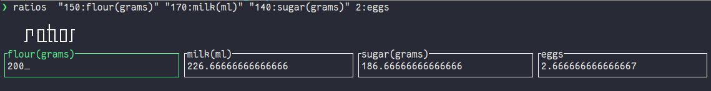

# Ratios

cli tool to quickly adjust the ratio of a recipe.

# Run

```bash
ratoes 12 12.1 1000
```

or with names values!

```bash
ratios  "150:flour(grams)" "170:milk(ml)" "140:sugar(grams)" 2:eggs
```

# Install

```bash
cargo install ratios --locked
```
